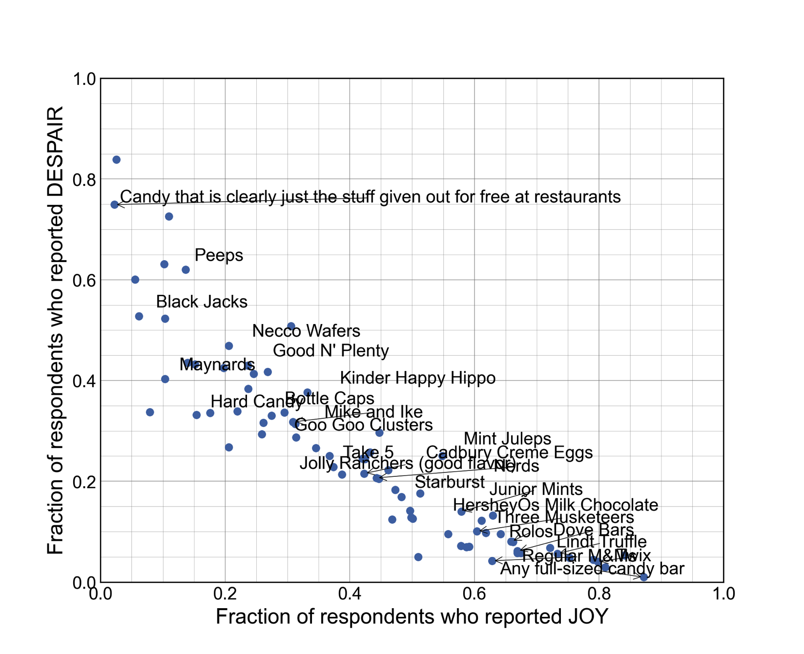

::: {.panel-tabset}

##### Description

```{r iter2Plot, fig.align = "center", echo = FALSE, out.width="100%", fig.alt = "This iteration uses the candy names to label the points. We notice that Any full sized candy bar is on the extreme for the most joy and least despair. Other chocolate candies like Twix and Kit Kat and 100 Grand Bar are near it. On the other extreme are candies like Mary Janes, Peeps, circus peanuts, gum from baseball cards, etc."}
ottrpal::include_slide("https://docs.google.com/presentation/d/1fu-KfdN2ldOXB49o9zdpurFbVvl1bOh8cfQ3vu0szk4/edit?slide=id.g3be338b6b90_0_25#slide=id.g3be338b6b90_0_25")
```

This second iteration is another exploratory data analysis step. Now that we've confirmed the relationship between the variables that we expected, we want to know what candies are the most highly ranked and what candies are the least highly ranked. We can use the categorical candy name variable for this and add labels directly to the points.

##### R code

```{r}
#| label: iter2R
#| warning: false
#| message: false
#| code-fold: show
#| code-summary: "R code for adding the candy names as labels"

library(ggrepel) #<1>

to_plot %>%
  ggplot(aes(x = JOY,
             y = DESPAIR,
             label = column_name #<2>
            )
         ) +
  geom_point() +
  xlim(0, 1) +
  ylim(0, 1) +
  theme_bw() +
  geom_text_repel(show.legend = FALSE, max.overlaps = 20) + #<3>
  labs(x = "Fraction of respondents who reported JOY",
       y = "Fraction of respondents who reported DESPAIR") +
  theme(text = element_text(size = 14))
```

1. Need to load [ggrepel package](https://ggrepel.slowkow.com/) for the labeling function
2. Specifies the candy names/variable that will be used for labeling
2. Uses `geom_text_repel()` from `ggrepel` package to label the points, using the repel part of the function to handle overlapping points/labels

##### Python code

<!--
The adjust_text function has a lot of output that cannot be suppressed in the usual ways because it is standard out.
The only way to suppress it is to set output to false.
But then the code blocks are cut up wherever there would be output and the code annotation for #<2> isn't connected with its comment properly.
So setting this chunk such that it will not evaluate during rendering and just embedding the output figure manually.
-->

```{python}
#| label: iter2Python
#| eval: false
#| code-fold: show
#| code-summary: "Python code for adding the candy names as labels"

from adjustText import adjust_text                                               #<2>

mpl.rcParams["font.size"] = 14

plt.style.use('seaborn-v0_8-deep')
fig2, ax2 = plt.subplots()
ax2.scatter(just_candy_props['likeness'], just_candy_props['dislikeness'], s = 10) #<3>
ax2.set_xlim(0,1)
ax2.set_ylim(0,1)
ax2.minorticks_on()
ax2.grid(which='major', linestyle='-', linewidth='0.5', color='grey', alpha=0.7)
ax2.grid(which='minor', linestyle=':', linewidth='0.3', color='grey', alpha=0.5)
ax2.set_xlabel('Fraction of respondents who reported JOY')
ax2.set_ylabel('Fraction of respondents who reported DESPAIR')
texts = [plt.text(just_candy_props['likeness'].iloc[i],                          #<4>
                  just_candy_props['dislikeness'].iloc[i],                       #<4>
                  just_candy_props.index[i],                                     #<4>
                  fontsize = 6)                                                  #<4>
          for i in range(len(just_candy_props))]                                 #<4>
adjust_text(texts,                                                               #<5>
  avoid_points = True)                                                           #<5>
plt.show()
plt.close()
```

2. Need to load [adjustText package](https://adjusttext.readthedocs.io/en/latest/index.html) for the labeling function. Python equivalent of ggrepel.
3. Decreasing the size of the points a bit for readability. Default is s = 35.
4. Using list comprehension to build an input to the labeling function of what the labels are and where they're going to go. Only labeling one out of every three candies to avoid overcrowding.
5. Using the adjust_text function from the adjustText package to automatically adjust the position of text labels to minimize overlaps

<!--
The image embedded below was saved locally after running the above code manually. Note that it does NOT autoupdate if any changes are made to the content.
-->

{fig-alt="Python plot that labels the candy names"}

:::
