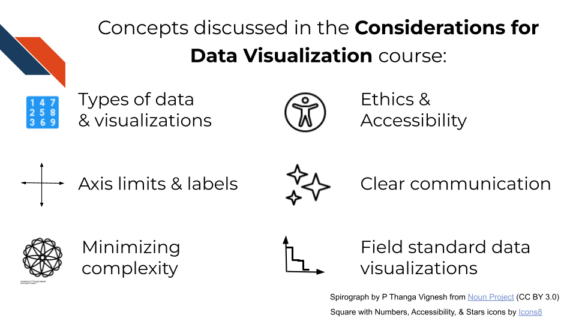
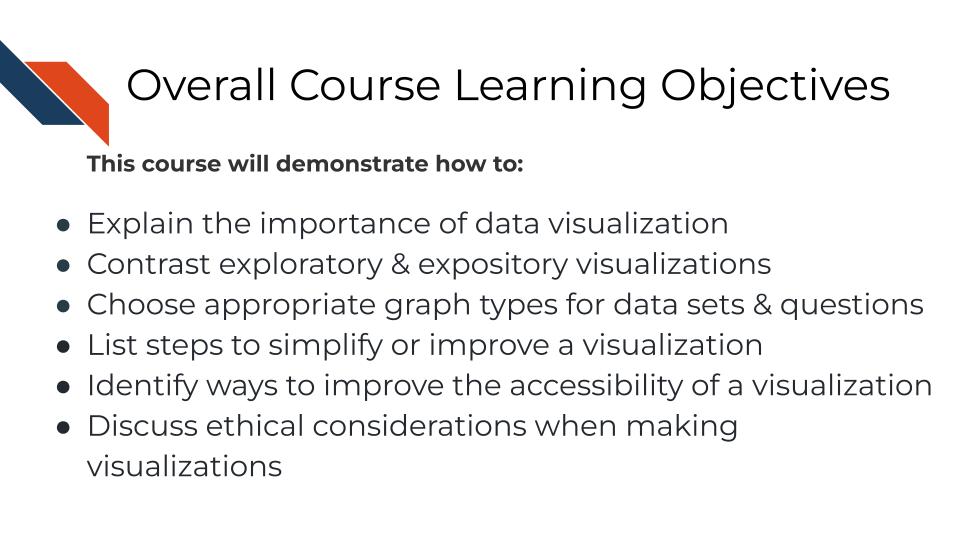

# Introduction

This course is meant to discuss best practices when constructing data visualizations with a special focus on graphs within biology research.

## Motivation

Data is now used more than ever to evaluate and understand questions across many fields including pubic health, bioinformatics, and clinical research.  It is critical to produce effective visual summaries of our data. Data visualization is useful for exploration, validation, and presentation of research, aiding in the understanding of underlying biology in datasets, debugging errors in informatics workflows, and identifying/avoiding sources of bias. This course is designed to introduce key concepts of data visualization, in particular for visualizing complex data and accessibility. In addition we will point to additional resources.

## Target audience  

The course is intended for anyone who has an interest in data visualization, but contains sections of specific interest for cancer researchers with experience using basic informatics tools.

## Curriculum

The course covers why data visualizations are important for communication within the biomedical and bioinformatics fields as well as best practices and design principles that researchers should consider when constructing data visualizations for their work.

## Objectives

