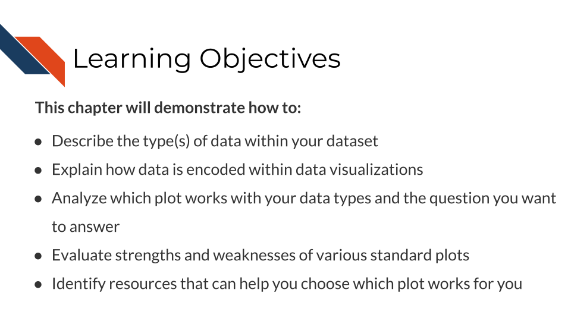

# Which visualization should I use?

A data visualization is made up of data and ...

Deciding which data visualization to use ...

## Learning Objectives

## Data types

## Graph types

## Data encodings

### Shape

### Color

### Area, Line, point, ...

### Labels

## Questions

## Galleries
